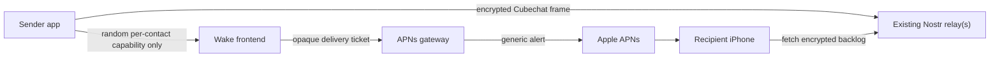

# Private APNs wake relay

Status: **Proposed**

Date: 2026-07-27

## Decision

Cubechat should add an optional APNs **wake plane**, separate from the existing
BLE/Nostr **message plane**.

- Messages, media, sender identity, and chat routing continue to travel only as
  the existing end-to-end encrypted Cubechat frames over BLE or Nostr.
- A sender whose encrypted frame was accepted by a Nostr relay sends a second,
  content-free `wake` request.
- The request contains only a random, recipient-issued capability. It contains
  no `npub`, event id, sender id, message type, message size, or ciphertext.
- APNs displays a generic “New Cubechat message” alert. It may also give the app
  a background fetch opportunity, but correctness must not depend on that
  opportunity.
- When the app gets execution time, it fetches and verifies the actual message
  from the existing Nostr relays. A wake relay is never a message source and is
  never trusted as evidence that a message exists.

The production design separates the public wake frontend from the APNs gateway.
They may be co-located for the first deployment, but the protocol must not
require that:



This is deliberately a doorbell, not another relay protocol.

## Why a visible push is required

`BGAppRefreshTask` remains useful as a catch-up mechanism, but iOS chooses its
schedule. A background-only APNs notification is also best effort: Apple may
delay, coalesce, throttle, or discard it, and it must not be treated as a
reliable message alert.

A visible remote notification is different: the OS can present it while the
Cubechat process is not running. The app can include `content-available: 1` for
an opportunistic fetch, but the user-visible fallback is the generic
system alert. APNs is still a best-effort service. If the user force-quits
the app, the alert may still be presented
while the fetch waits until the user taps and launches Cubechat.

Consequences:

- Version 1 does not promise rich sender/message text for a terminated app.
- The generic notification opens Cubechat, not a specific chat.
- Inline Reply is unavailable on the generic notification because there is no
  chat identifier in its payload.
- Once the real message is fetched and decrypted, the current local
  notification path can replace the generic alert with the existing rich
  notification.

Relevant Apple contracts:

- [Setting up a remote notification server](https://developer.apple.com/documentation/usernotifications/setting-up-a-remote-notification-server)
- [Registering your app with APNs](https://developer.apple.com/documentation/usernotifications/registering-your-app-with-apns)
- [Pushing background updates to your app](https://developer.apple.com/documentation/usernotifications/pushing-background-updates-to-your-app)
- [Sending notification requests to APNs](https://developer.apple.com/documentation/usernotifications/sending-notification-requests-to-apns)
- [Handling notification responses from APNs](https://developer.apple.com/documentation/usernotifications/handling-notification-responses-from-apns)

## Goals

1. Notify an iOS user promptly when a 1:1 message is waiting on Nostr and the
   Cubechat process is suspended or terminated.
2. Keep plaintext, ciphertext, `npub`, Cubechat identity keys, sender identity,
   chat id, and Nostr event id out of the wake service.
3. Preserve the existing end-to-end verification and deduplication path. A wake
   must never create a chat message by itself.
4. Preserve per-contact mute, block, and revocation without telling the service
   which Cubechat identity was muted or blocked.
5. Keep BLE-only operation fully functional and keep internet/push explicitly
   opt-in.
6. Make the wake frontend self-hostable without distributing Cubechat's APNs
   provider signing key.
7. Fail open for message delivery: if push fails, the ciphertext remains on
   Nostr and is fetched on the next normal app launch or background refresh.

## Non-goals for version 1

- Guaranteed silent background execution.
- Sender name, avatar, message preview, chat id, or media in the APNs payload.
- A Notification Service Extension that reimplements Cubechat crypto in Swift.
- Push for channel posts. The current channel implementation publishes a
  broadcast frame to recent peers and lets recipients test the encrypted
  channel tag; the sender does not have an authoritative member list. Waking
  every recent peer would create false notifications.
- Replacing Nostr storage or WebSocket delivery.
- Hiding all network metadata. TLS does not hide timing or endpoint IPs, and
  colluding operators can correlate traffic.

## Identifiers and secrets

No push identifier is derived from `npub`, X25519, Ed25519, a nickname, a chat
id, or an APNs token.

Each iOS installation creates a dedicated push control key pair. It is unrelated
to the Cubechat identity and is stored in Keychain:

```text
push_control_key = random Ed25519 key pair
```

The APNs gateway issues a random delivery ticket for the installation:

```text
delivery_ticket = random(32 bytes)
ticket_lookup    = SHA-256("cubechat/apns-ticket/v1" || delivery_ticket)
```

For each contact allowed to wake this device, the recipient creates a separate
capability:

```text
wake_capability = random(32 bytes)
cap_lookup       = SHA-256("cubechat/wake-cap/v1" || wake_capability)
```

The gateway stores `ticket_lookup -> encrypted APNs token`. The wake frontend
stores `cap_lookup -> delivery_ticket`. Neither database stores the bearer
secret used to look up its row.

Per-contact capabilities are required rather than optional hardening:

- muting or blocking one peer can revoke only that peer's wake path;
- a leaked contact card or malicious contact cannot force rotation for every
  other contact;
- wake timing from different contacts is not labelled with a common public
  Cubechat identifier.

A single-service deployment can correlate all capabilities that map to the same
device token. Splitting the frontend and gateway removes that direct mapping
from either component, unless the operators collude or correlate network
timing.

## Capability distribution

`WakeCapabilityV1` is application data, never an APNs or Nostr tag:

```text
version             u8 = 1
wake_frontend_url   HTTPS URL
wake_capability     32 random bytes
expires_at          u64 unix seconds
audience_peer_hash  32 bytes
```

It is bound to the recipient's existing Ed25519 identity and to the intended
peer with the normal `SignedPayload` context. The server never receives the
signature or `audience_peer_hash`.

Distribution rules:

1. After a Noise-authenticated BLE session, each side sends the other a sealed
   `wakeCapability` control payload.
2. The sealed Nostr introduction includes the descriptor so an off-mesh peer
   can wake the sender on the reply path.
3. A new `cubechat:c2:` contact card may include a short-lived bootstrap
   capability. Generating a card creates a fresh capability. After the first
   authenticated reply, the app replaces it with a peer-bound capability and
   revokes the bootstrap capability.
4. Capability refresh and revocation use the same encrypted control path.
5. A cleartext mesh announcement must not contain a wake capability. Otherwise
   every passive BLE observer could ring the device and link the capability to
   the public announcement.

The wake frontend URL is recipient-selected, so clients must accept only HTTPS,
must reject credentials, fragments, loopback/private/link-local targets and
unsafe redirects, and should require explicit user approval before contacting a
non-default provider. This prevents a malicious contact descriptor from turning
Cubechat into a local-network request primitive.

## Protocol

All endpoints use HTTPS, `Content-Type: application/json`, small fixed size
limits, and `Cache-Control: no-store`. Request bodies and authorization headers
must be excluded from access logs.

### 1. APNs delivery ticket

The iOS app sends its APNs token directly to the APNs gateway:

```http
POST /v1/tickets

{
  "version": 1,
  "control_pubkey": "<base64url>",
  "device_token": "<base64url>",
  "environment": "sandbox | production",
  "topic": "com.cubechat.cubechat",
  "timestamp": 1785100000,
  "nonce": "<base64url-16-bytes>",
  "signature": "<base64url-ed25519>"
}
```

The signature covers a fixed binary transcript, not a serializer-dependent JSON
representation:

```text
"cubechat/apns-ticket-register/v1\0" ||
control_pubkey || device_token_length || device_token ||
environment || topic_length || topic || timestamp_be64 || nonce
```

The response contains the bearer `delivery_ticket`, its lease expiry, and a
gateway-generated registration id. The ticket is shown only once. Token update,
lease renewal, and deletion require a fresh nonce/timestamp and an Ed25519
signature from the stored control key.

The gateway must not assume an APNs device-token length. Sandbox and production
tokens are distinct and must never be mixed.

### 2. Register a wake capability

The recipient registers a capability hash with its chosen wake frontend:

```http
POST /v1/capabilities

{
  "version": 1,
  "cap_lookup": "<base64url-sha256>",
  "delivery_gateway": "https://push-gateway.example",
  "delivery_ticket": "<base64url>",
  "expires_at": 1792876000,
  "control_pubkey": "<base64url>",
  "timestamp": 1785100000,
  "nonce": "<base64url-16-bytes>",
  "signature": "<base64url-ed25519>"
}
```

The frontend stores the capability hash, opaque ticket, expiry, and the control
public key needed for update/revocation. It does not receive an APNs token or a
Cubechat identity.

An implementation may replace `delivery_gateway` with a configured gateway id
to avoid arbitrary server-side outbound URLs.

### 3. Wake

After at least one Nostr relay accepts a notification-worthy frame, the sender
posts:

```http
POST /v1/wake

{
  "version": 1,
  "capability": "<base64url-32-random-bytes>"
}
```

The frontend computes `cap_lookup`, finds the opaque delivery ticket, coalesces
the request, and asks the APNs gateway to deliver template `cubechat-wake-v1`.

The response is always `202 Accepted`, including for unknown, expired, revoked,
or rate-limited capabilities. This avoids turning the API into a capability
existence oracle.

The wake call has no Nostr signature. Signing it with the sender's stable Nostr
key would reveal exactly the identity the protocol is designed to omit.

### 4. Gateway delivery

The frontend presents the opaque ticket to the gateway:

```http
POST /v1/deliver

{
  "version": 1,
  "delivery_ticket": "<base64url>",
  "template": "cubechat-wake-v1"
}
```

The API only accepts compiled, generic templates. It never accepts caller
supplied alert text, badge values, URLs, or custom payload fields. A compromised
frontend can cause nuisance generic alerts for tickets it holds, but cannot
phish through arbitrary notification text or read APNs tokens.

For a co-located first deployment this is an internal call, but keeping the
boundary makes future self-hosted wake frontends possible. An arbitrary
self-hosted service cannot send APNs for the official Cubechat bundle on its
own: distributing the official `.p8` provider key would compromise every
installation. The gateway boundary is therefore unavoidable for the official
build. A fork with a different bundle id can run its own gateway and APNs key.

## APNs request

The gateway uses token-based APNs authentication over a long-lived HTTP/2
connection. The `.p8` key lives only in a secret manager available to the
gateway worker, never in the repository, frontend, database, or client.

Headers for the generic alert:

```text
:method            POST
:path              /3/device/<token>
authorization      bearer <ES256 provider JWT>
apns-topic         com.cubechat.cubechat
apns-push-type     alert
apns-priority      10
apns-expiration    now + 1 hour
apns-collapse-id   cubechat-wake-v1
```

Payload:

```json
{
  "aps": {
    "alert": {
      "title-loc-key": "PUSH_WAKE_TITLE",
      "loc-key": "PUSH_WAKE_BODY"
    },
    "sound": "default",
    "content-available": 1,
    "category": "cubechat_wake",
    "thread-id": "cubechat-wake"
  },
  "cc": "wake-v1"
}
```

`loc-key` keeps locale out of the registry. There is no badge because the
service cannot know an unread count. `cubechat_wake` is a new category with an
Open action only; it must not reuse the current `cubechat_message` inline-reply
category.

`content-available` is an optimization. The push type remains `alert` because
the payload displays an alert. Cubechat must behave correctly if iOS presents
the alert without launching or resuming the application.

The gateway:

- refreshes its provider JWT on Apple's required cadence;
- reuses HTTP/2 connections;
- backs off on APNs `5xx` and `429`;
- deletes/disables the token mapping on `410 Unregistered`;
- does not retry permanent `4xx` failures;
- records the APNs request id only in a short-lived, access-controlled delivery
  log needed for debugging.

## Client integration

### iOS native layer

1. Add Push Notifications capability and a signed `aps-environment`
   entitlement for `com.cubechat.cubechat`.
2. Add `remote-notification` to `UIBackgroundModes`; keep the current
   `BGAppRefreshTask` as fallback.
3. Call `registerForRemoteNotifications()` only after the user enables private
   push and notification authorization is available.
4. Implement:
   - `application(_:didRegisterForRemoteNotificationsWithDeviceToken:)`
   - `application(_:didFailToRegisterForRemoteNotificationsWithError:)`
   - `application(_:didReceiveRemoteNotification:fetchCompletionHandler:)`
5. Pass token changes to Dart over a dedicated method/event channel. Never log
   a raw token, delivery ticket, or wake capability.
6. On `cc == wake-v1`, invoke the existing bounded relay catch-up path and
   report `.newData`, `.noData`, or `.failed` before iOS's deadline.
7. If the app is foregrounded, suppress the generic alert and let the actual
   decrypted inbound message decide whether a local notification is needed.
8. When a real message replaces the generic alert, remove the delivered remote
   request identified by the stable `apns-collapse-id`.

### Dart layer

Add small, independent services instead of putting APNs details into
`MessagingService`:

```text
lib/core/notifications/push_registration_service.dart
lib/core/notifications/wake_capability_store.dart
lib/core/notifications/wake_client.dart
```

Extend the encrypted known-peer record with a `WakeEndpoint`:

```text
frontend URL
capability bytes
expiry
descriptor version
```

Never put capabilities in plaintext preferences or diagnostics exports.
Emergency Wipe attempts remote deletion first, then always removes local
tickets, control keys, and capabilities even if the network deletion fails.
Server leases ensure abandoned remote mappings eventually expire.

Add a new encrypted control payload type for capability exchange/revocation.
Unknown payload types must remain safely ignorable for old clients.

### Send policy

A wake is emitted once per **logical, user-visible** message, never once per
frame:

| Outbound item | Wake |
|---|---:|
| 1:1 text | once, after a Nostr `OK` |
| 1:1 photo/voice | once, after manifest and all required chunks are accepted |
| direct channel invite | once |
| receipt/read receipt | no |
| reaction/edit/delete | no |
| presence/announcement/capability update | no |
| media chunk | no |
| channel post | no in v1 |

`WebSocketNostrRelayClient.publish()` currently returns after writing to a
socket, not after a relay's `OK`. Before wake is enabled, publishing must expose
an acceptance result keyed by event id, with a short bounded timeout. Otherwise
an APNs alert can be sent for an event every Nostr relay rejected.

For the first implementation, preserve current routing and emit a wake only
when the Nostr fallback path was actually selected. A later reliability pass
can mirror an encrypted frame to Nostr after a short missing-delivery-receipt
grace period; dedup already makes the duplicate frame safe. That policy change
must be measured separately because mirroring every BLE send leaks additional
metadata to Nostr and can produce redundant alerts.

## Rate limiting and coalescing

The wake endpoint is a bearer-capability API and must assume a legitimate
contact can be malicious.

- Coalesce a burst for the same delivery ticket for 2–5 seconds.
- Use the same `apns-collapse-id` so APNs replaces a pending generic alert.
- Apply per-capability and per-ticket limits. Start conservatively at 6/minute
  and 60/hour, then tune from aggregate metrics.
- Apply a global abuse limit using an in-memory, daily-rotated keyed hash of the
  source IP. Do not persist source IP addresses in normal logs.
- Cap active capabilities per ticket/device.
- Keep unknown/revoked/rate-limited responses indistinguishable (`202`).
- Allow immediate per-peer capability revocation on mute or block.

Rate limiting controls notification spam; it must never delete or reject the
actual Nostr message.

## Data retention

Recommended defaults:

- Delivery ticket/APNs token lease: 90 days, renewed on normal app launches.
- Per-contact capability lease: 90 days, refreshed over the encrypted control
  path.
- Bootstrap contact-card capability: 7 days and revoked after successful
  authenticated replacement.
- Pending coalescing state: memory only, at most 30 seconds.
- APNs response diagnostics: at most 24 hours, with no token/capability value.
- Aggregate counters: no mailbox, ticket, token, `npub`, IP, or event labels.

APNs tokens are encrypted at rest with envelope encryption. The database key and
the APNs `.p8` key are separate secrets with separate access policy.

## Threat model

| Observer | Learns |
|---|---|
| Public Nostr relay | Existing metadata: sender `npub`, recipient `npub`, time, ciphertext size/content |
| Wake frontend | Capability hash, opaque delivery ticket, wake timing; source IP while the request is live |
| APNs gateway | APNs token, opaque delivery ticket, push timing, app topic |
| Apple APNs | Device/app routing token, time, generic localized alert |
| Recipient's contact | The one capability issued to that contact and the selected frontend |

The wake frontend does **not** learn the Nostr event, either `npub`, sender,
message type, chat id, plaintext, or ciphertext. The APNs gateway does not learn
the per-contact capability.

Residual risks:

- A frontend and gateway that collude can join ticket timing and token data.
- Timing and IP correlation can associate a sender with a capability.
- A contact can share its capability or deliberately spam it.
- A compromised gateway with the APNs provider key can send generic Cubechat
  pushes. It still cannot create a verified Cubechat message.
- Apple necessarily sees the app topic, device routing token, time, and generic
  payload.

These limitations must be stated in the UI and README; “server learns nothing”
would be false.

## Failure behaviour

| Failure | Result |
|---|---|
| Wake frontend unavailable | Message remains on Nostr; no timely alert |
| APNs gateway/APNs unavailable | Bounded retry; message remains on Nostr |
| Stale APNs token | Gateway disables it on `410`; app registers the new token next launch |
| Push arrives before relay event is queryable | Bounded fetch window/retry; normal backlog fetch later |
| iOS grants no background execution | Generic alert remains; tapping launches and fetches |
| User denied notification permission | No ticket/capabilities are advertised |
| Peer is muted/blocked | Its per-contact capability is revoked |
| Fake/unknown capability wake | Uniform `202`; no APNs delivery |
| Malicious valid wake | At worst a generic alert, bounded by rate limits; no fake chat message |
| Emergency Wipe while offline | Local secrets are deleted immediately; server lease expires later |

## Rollout

### Phase 0 — Apple and build prerequisites

- Enrol/sign with an Apple Developer account.
- Enable Push Notifications for `com.cubechat.cubechat`.
- Create separate sandbox and production configuration.
- Provision the APNs token signing key in a secret manager.
- Add entitlements and physical-device push tests.

### Phase 1 — generic official relay

- Deploy a co-located wake frontend/gateway with the logical API boundary.
- Add token registration, generic alert handling, and bounded Nostr catch-up.
- Add a user-facing “Private push (iOS)” opt-in with an exact metadata
  disclosure.
- Keep `BGAppRefreshTask`.

### Phase 2 — per-contact capabilities

- Add encrypted capability exchange, persistence, expiry, mute/block revocation,
  and `cubechat:c2` bootstrap cards.
- Await Nostr `OK` and send one wake per logical 1:1 item.
- Run compatibility tests against clients that ignore the new control payload.

### Phase 3 — split/self-hosted frontend

- Separate the official APNs gateway from the wake frontend.
- Publish the wake-frontend protocol and a reference implementation.
- Permit custom frontends only after explicit user consent and strict URL
  validation.
- Official builds still use the official APNs gateway; custom app builds can
  use their own bundle id, gateway, and Apple credentials.

### Phase 4 — channels, only with real membership

Design authenticated channel membership or per-channel wake capabilities before
enabling channel pushes. Do not infer membership from “known recent peer”.

## Acceptance criteria

1. A physical iPhone with Cubechat terminated receives a generic alert after a
   1:1 frame is accepted by Nostr.
2. A force-quit test requires the alert to be visible, but does not assert that
   Dart ran before the user tapped.
3. Inspecting frontend requests, database rows, gateway requests, APNs payloads,
   and logs reveals no `npub`, event id, message type, chat id, ciphertext, or
   plaintext.
4. A fetched frame still passes the existing Nostr signature, Cubechat
   decryption/signature, replay, dedup, block, and storage path.
5. A text emits at most one wake; a multi-chunk photo/voice message emits at
   most one; receipts/presence/media chunks emit none.
6. Muting or blocking one peer disables only that peer's capability.
7. Unknown and revoked capabilities are indistinguishable over the API.
8. APNs `410` removes the inactive token; `429/5xx` use bounded backoff; permanent
   `4xx` responses are not retried.
9. APNs token rotation updates the existing ticket without changing Cubechat
   identity.
10. BLE-only mode and clients without push support behave exactly as before.

## Product wording

Once this is implemented, the unqualified “serverless” promise needs a precise
scope. Suggested README wording:

> Cubechat's BLE mesh is accountless and serverless. Internet fallback and
> timely iOS notifications are optional: encrypted frames may use user-selected
> Nostr relays, and iOS may use a content-blind APNs wake service. The wake
> service receives only random revocable capabilities and timing metadata, not
> messages or Cubechat identities.

The settings disclosure should be shorter but equally direct:

> Private push sends a random wake capability to the selected service when a
> contact has encrypted mail for you. The service cannot read the message or
> see your Cubechat identity, but it can observe wake timing and network
> metadata. Apple receives a generic Cubechat notification.
